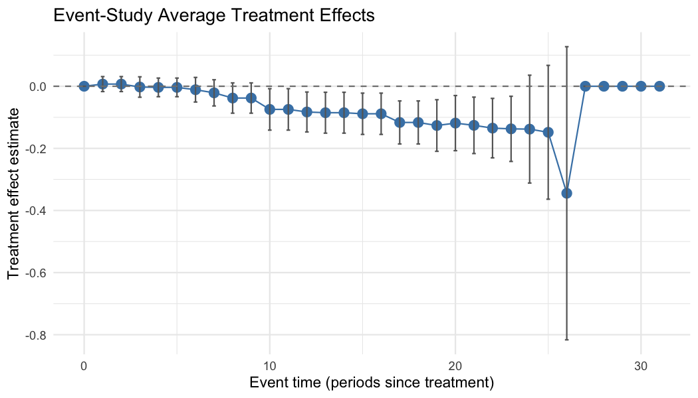

<!-- README.md is generated from README.Rmd. Please edit that file and re-knit with devtools::build_readme(). -->

# Fused Extended Two-Way Fixed Effects

<!-- badges: start -->

[](https://CRAN.R-project.org/package=fetwfe)
[](https://CRAN.R-project.org/package=fetwfe)
[](https://lifecycle.r-lib.org/articles/stages.html#stable)
<!-- badges: end -->

The `{fetwfe}` package implements *fused extended two-way fixed effects*
(FETWFE), a methodology for estimating treatment effects in
difference-in-differences with staggered adoptions.

In staggered-adoption settings — where units become treated at different
times — treatment effects typically vary across adoption cohorts and
over time since treatment. The conventional two-way fixed effects (TWFE)
estimator is biased when effects are heterogeneous like this, because it
effectively uses already-treated units as controls for newly-treated
ones, contaminating the estimate.

FETWFE instead fits a *fully heterogeneous* model — a separate effect
for every cohort and time period — and applies a **fusion penalty** that
shrinks together effects which are similar across neighboring cohorts
and periods. This pools the cohort-by-time effects in a data-driven way
(collapsing them where they genuinely agree, keeping them distinct where
they differ) and, unlike ad hoc model selection, comes with
**asymptotically valid standard errors and confidence intervals** for
the resulting estimates.

- For a brief introduction to the methodology, as well as background on
  difference-in-differences with staggered adoptions and motivation for
  FETWFE, see this [blog
  post](https://gregoryfaletto.com/2023/12/13/new-paper-fused-extended-two-way-fixed-effects-for-difference-in-differences-with-staggered-adoptions/).
- For more detailed slides on the methodology (but less detailed than
  the paper), see
  [here](https://gregoryfaletto.com/2024/02/11/presentation-on-fused-extended-two-way-fixed-effects/).
- Check out the most recent draft of the full paper
  [here](https://arxiv.org/abs/2312.05985).
- This [blog
  post](https://gregoryfaletto.com/2025/01/03/new-r-fetwfe-package-implementing-fused-extended-two-way-fixed-effects/)
  explains a little more about what the package does under the hood, if
  you’re interested.

## Installation

To install the released version of `{fetwfe}` from CRAN:

``` r
install.packages("fetwfe")
```

Or the latest development version from GitHub:

``` r
# install.packages("remotes")  # if needed
remotes::install_github("gregfaletto/fetwfePackage")
```

## A worked example: fit, extract, plot

The primary function is `fetwfe()`. Here it is applied to the `divorce`
dataset from the `bacondecomp` package — the unilateral (“no-fault”)
divorce / female-suicide panel of Stevenson and Wolfers (2006),
reproducing the empirical application in Faletto (2025, Sec. 8.2):

``` r
library(fetwfe)
library(bacondecomp)

data(divorce)
# Female subset; `changed` is the absorbing 0/1 divorce-reform indicator, and the
# response is the elasticity-scaled female suicide rate. Noise variances are
# supplied (precomputed by REML) to keep the call fast.
divorce_f <- divorce[divorce$sex == 2, ]

res <- fetwfe(
    pdata = divorce_f,
    time_var = "year",
    unit_var = "st",
    treatment = "changed",
    covs = c("murderrate", "lnpersinc", "afdcrolls"),
    response = "suiciderate_elast_jag",
    sig_eps_sq = 0.0344,
    sig_eps_c_sq = 0.1507,
    add_ridge = TRUE,
    q = 0.5
)
```

**1. The overall ATT.** The aggregated effect and its 95% Wald interval:

``` r
round(c(
    ATT = res$att_hat,
    SE = res$att_se,
    CI_low = res$att_hat - qnorm(0.975) * res$att_se,
    CI_high = res$att_hat + qnorm(0.975) * res$att_se
), 4)
#>     ATT      SE  CI_low CI_high 
#> -0.0602  0.0188 -0.0970 -0.0233
```

(`summary(res)` prints the full report — overall ATT, per-cohort and
event-study effects, and model details.)

**2. The heterogeneity underneath.** The overall ATT is an average;
`cohortStudy()` and `eventStudy()` return the effects by *adoption
cohort* and by *time since treatment* as tidy data frames — the effects
FETWFE kept distinct rather than fusing to zero:

``` r
cohortStudy(res)
#>    cohort    estimate          se       ci_low      ci_high      p_value selected
#> 1    1969  0.00000000 0.000000000  0.000000000  0.000000000           NA    FALSE
#> 2    1970 -0.44401171 0.046498180 -0.572555500 -0.315467910 0.000000e+00     TRUE
#> 3    1971 -0.02633974 0.020112012 -0.081939211  0.029259735 8.474215e-01     TRUE
#> 4    1972 -0.01611957 0.009359074 -0.041992646  0.009753503 5.468636e-01     TRUE
#> 5    1973 -0.06452464 0.013062067 -0.100634602 -0.028414670 7.037396e-06     TRUE
#> 6    1974 -0.03001991 0.012978739 -0.065899516  0.005859696 1.707508e-01     TRUE
#> 7    1975  0.00000000 0.000000000  0.000000000  0.000000000           NA    FALSE
#> 8    1976 -0.04379642 0.063672429 -0.219818269  0.132225428 9.976219e-01     TRUE
#> 9    1977 -0.12389080 0.024178412 -0.190731798 -0.057049799 2.691903e-06     TRUE
#> 10   1980 -0.04013225 0.061547270 -0.210279123  0.130014613 9.984244e-01     TRUE
#> 11   1984  0.00000000 0.000000000  0.000000000  0.000000000           NA    FALSE
#> 12   1985  0.14972561 0.050875421  0.009080968  0.290370244 2.880518e-02     TRUE
```

**3. Plot it.** `plot()` draws the event-study estimates with confidence
intervals (or per-cohort average effects with `type = "catt"`):

``` r
plot(res, type = "event_study")
```



For the full set of vignettes and function documentation, see the
[package website](https://gregfaletto.github.io/fetwfePackage/) and the
[CRAN page](https://CRAN.R-project.org/package=fetwfe).

## Penalty and fusion structures

A core differentiator of FETWFE is the *geometry* of its fusion penalty,
chosen via the `fusion_structure` argument of `fetwfe()`:

- **`"cohort"`** (the default) fuses treatment effects within and
  between cohorts — the two-way fusion structure of Faletto (2025).
- **`"event_study"`** instead fuses effects at the same time since
  treatment (event time `e = t - g`) across cohorts — the package
  realization of the paper’s event-study-penalty theory.

For full control, the `fusion_matrix` argument accepts any invertible
`num_treats x num_treats` differencing matrix `D_N`, encoding an
arbitrary fusion structure beyond the two built-ins. The same
`fusion_structure` option is available in `genCoefs()` for simulation
studies.

For guidance on which to use, see the vignette *“Choosing a fusion
structure: cohort vs. event-study penalties”* —
`vignette("fusion_structure_vignette", package = "fetwfe")`.

## References

- Faletto, G (2025). *Fused Extended Two-Way Fixed Effects for
  Difference-in-Differences with Staggered Adoptions*. [arXiv preprint
  arXiv:2312.05985](https://arxiv.org/abs/2312.05985).
