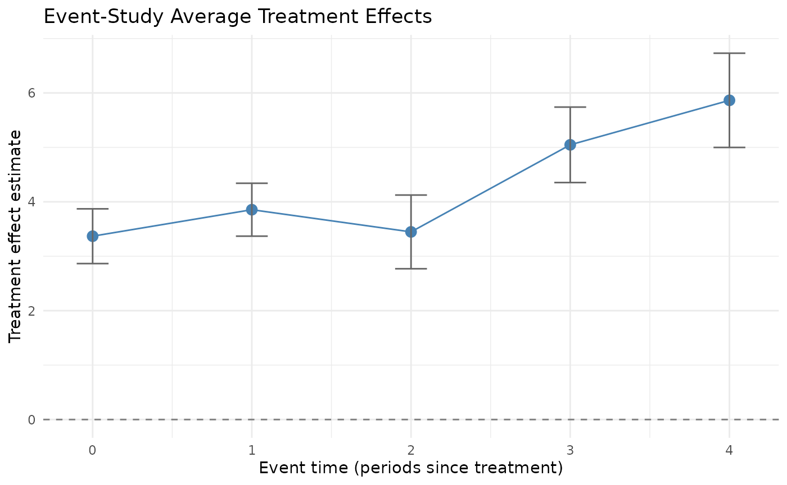
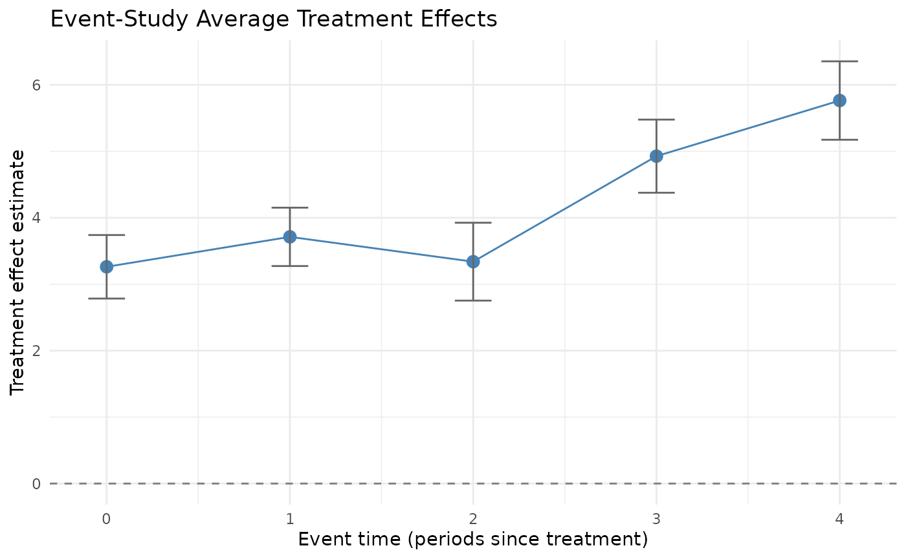

# Comparison Estimators: ETWFE and BETWFE

``` r

library(fetwfe)
```

## Introduction

The [fetwfe](https://gregfaletto.github.io/fetwfePackage/) package
implements
[`fetwfe()`](https://gregfaletto.github.io/fetwfePackage/reference/fetwfe.md)
as its recommended estimator for difference-in-differences with
staggered adoptions. It also exports two related estimators that serve
as comparison baselines:

- [`etwfe()`](https://gregfaletto.github.io/fetwfePackage/reference/etwfe.md)
  — Wooldridge-style extended two-way fixed effects.
- [`betwfe()`](https://gregfaletto.github.io/fetwfePackage/reference/betwfe.md)
  — bridge-penalized ETWFE; like
  [`fetwfe()`](https://gregfaletto.github.io/fetwfePackage/reference/fetwfe.md)
  but without the fusion transformation.

This vignette demonstrates both, on simulated data so we can compare
each estimator against the known true treatment effects.

For background on staggered-adoption DiD and a real-data application of
the recommended
[`fetwfe()`](https://gregfaletto.github.io/fetwfePackage/reference/fetwfe.md)
estimator, see [the main
vignette](https://CRAN.R-project.org/package=fetwfe). For the underlying
simulation pipeline used here, see [the simulation
vignette](https://CRAN.R-project.org/package=fetwfe). For methodological
details, see [Faletto (2025)](https://arxiv.org/abs/2312.05985).

All three estimators
([`fetwfe()`](https://gregfaletto.github.io/fetwfePackage/reference/fetwfe.md),
[`etwfe()`](https://gregfaletto.github.io/fetwfePackage/reference/etwfe.md),
[`betwfe()`](https://gregfaletto.github.io/fetwfePackage/reference/betwfe.md))
accept the same call signature, so a user familiar with
[`fetwfe()`](https://gregfaletto.github.io/fetwfePackage/reference/fetwfe.md)
can drop in
[`etwfe()`](https://gregfaletto.github.io/fetwfePackage/reference/etwfe.md)
or
[`betwfe()`](https://gregfaletto.github.io/fetwfePackage/reference/betwfe.md)
simply by changing the function name. Below we use the
`*WithSimulatedData()` wrappers to keep the simulation flow concise.

## Setup: simulating panel data

We use the
[`genCoefs()`](https://gregfaletto.github.io/fetwfePackage/reference/genCoefs.md) +
[`simulateData()`](https://gregfaletto.github.io/fetwfePackage/reference/simulateData.md)
pipeline (the same approach as the simulation vignette). The parameters
below are chosen so that both
[`etwfe()`](https://gregfaletto.github.io/fetwfePackage/reference/etwfe.md)
and
[`betwfe()`](https://gregfaletto.github.io/fetwfePackage/reference/betwfe.md)
are well-conditioned: enough cohorts and units that
[`etwfe()`](https://gregfaletto.github.io/fetwfePackage/reference/etwfe.md)
doesn’t run into rank-deficiency, and enough density in the true
coefficient vector that
[`betwfe()`](https://gregfaletto.github.io/fetwfePackage/reference/betwfe.md)’s
bridge regularization shrinks toward zero without zeroing everything
out.

``` r

sim_coefs <- genCoefs(
  G         = 3,
  T         = 6,
  d         = 2,
  density   = 0.5,
  eff_size  = 2,
  seed      = 20260510
)

sim_data <- simulateData(
  sim_coefs,
  N            = 120,
  sig_eps_sq   = 1,
  sig_eps_c_sq = 1,
  seed         = 20260510
)

# True treatment effects (we'll compare estimator output to these):
true_tes <- getTes(sim_coefs)
cat("True overall ATT:", true_tes$att_true, "\n")
#> True overall ATT: 3.877778
print(true_tes$actual_cohort_tes)
#> [1] 4.800000 3.500000 3.333333
```

## `etwfe()`: extended TWFE without penalty

[`etwfe()`](https://gregfaletto.github.io/fetwfePackage/reference/etwfe.md)
implements the Wooldridge-style extended two-way fixed effects
estimator: cohort-time dummy interactions estimated by OLS, with no
regularization. Under the model’s assumptions it produces unbiased point
estimates and asymptotically exact standard errors. The trade-off
compared to
[`fetwfe()`](https://gregfaletto.github.io/fetwfePackage/reference/fetwfe.md)
is variance: with no fusion penalty, the estimator can be high-variance
in over-parameterized regimes, and it errors out entirely when cohorts
are small relative to the number of covariates (`(d + 1)` units per
cohort is the floor).

``` r

res_etwfe <- etwfeWithSimulatedData(sim_data)

summary(res_etwfe)
#> Summary of Extended Two-Way Fixed Effects
#> ========================================
#> 
#> Overall ATT: 3.8899  (SE = 0.1791, p = 1.498e-104, 95% CI = [3.5388, 4.2410])
#> 
#> CATT (preview) [simultaneous 95% CI]:
#>  cohort estimate        se   ci_low  ci_high p_value
#>       2 4.658986 0.2422635 4.083908 5.234063       0
#>       3 3.773047 0.2080983 3.279070 4.267023       0
#>       4 3.104032 0.2240861 2.572104 3.635960       0
#> 
#> Event Study (preview) [simultaneous 95% CI]:
#>  event_time n_cohorts estimate        se   ci_low  ci_high p_value
#>           0         3 3.368180 0.1994002 2.865330 3.871030       0
#>           1         3 3.855024 0.1926492 3.369199 4.340850       0
#>           2         3 3.447353 0.2684186 2.770452 4.124255       0
#>           3         2 5.046964 0.2749486 4.353595 5.740333       0
#>           4         1 5.864494 0.3432443 4.998895 6.730092       0
#> 
#> Model Details:
#>   Units (N)           : 120
#>   Time periods (T)    : 6
#>   Treated cohorts (G) : 3
#>   Covariates (d)      : 2
#>   Features (p)        : 62
```

We can compare the estimated overall ATT to the truth:

``` r

cat("True ATT:     ", true_tes$att_true, "\n")
#> True ATT:      3.877778
cat("Estimated ATT:", res_etwfe$att_hat, "\n")
#> Estimated ATT: 3.88994
cat("Squared error:", (res_etwfe$att_hat - true_tes$att_true)^2, "\n")
#> Squared error: 0.0001479292
```

## `betwfe()`: bridge-penalized ETWFE

[`betwfe()`](https://gregfaletto.github.io/fetwfePackage/reference/betwfe.md)
extends
[`etwfe()`](https://gregfaletto.github.io/fetwfePackage/reference/etwfe.md)
by adding a bridge (`L_q`, `0 < q < 1`) regularization penalty on the
cohort-time effects. Compared to
[`etwfe()`](https://gregfaletto.github.io/fetwfePackage/reference/etwfe.md),
this trades a small amount of bias for lower variance — the same idea as
[`fetwfe()`](https://gregfaletto.github.io/fetwfePackage/reference/fetwfe.md),
but without the fusion transformation that
[`fetwfe()`](https://gregfaletto.github.io/fetwfePackage/reference/fetwfe.md)
applies. So
[`betwfe()`](https://gregfaletto.github.io/fetwfePackage/reference/betwfe.md)
is essentially “fetwfe minus the fusion.”

``` r

res_betwfe <- betwfeWithSimulatedData(sim_data)

summary(res_betwfe)
#> Summary of Bridge-Penalized Extended Two-Way Fixed Effects
#> ==========================================================
#> 
#> Overall ATT: 3.7846  (SE = 0.1370, p = 4.325e-168, 95% CI = [3.5162, 4.0530])
#> Selected: TRUE
#> 
#> CATT (preview) [simultaneous 95% CI]:
#>  cohort estimate        se   ci_low  ci_high p_value selected
#>       2 4.478828 0.1820991 4.044556 4.913100       0     TRUE
#>       3 3.682706 0.1844766 3.242764 4.122648       0     TRUE
#>       4 3.071311 0.2010365 2.591877 3.550745       0     TRUE
#> 
#> Event Study (preview) [simultaneous 95% CI]:
#>  event_time n_cohorts estimate        se   ci_low  ci_high p_value
#>           0         3 3.261924 0.1874452 2.783997 3.739851       0
#>           1         3 3.712544 0.1722744 3.273298 4.151791       0
#>           2         3 3.339178 0.2297940 2.753274 3.925081       0
#>           3         2 4.926794 0.2158458 4.376454 5.477134       0
#>           4         1 5.763977 0.2314455 5.173862 6.354091       0
#> 
#> Model Details:
#>   Units (N)           : 120
#>   Time periods (T)    : 6
#>   Treated cohorts (G) : 3
#>   Covariates (d)      : 2
#>   Features (p)        : 62
#>   Selected size       : 42
#>   Lambda*             : 0.0099
```

Comparing against the truth and against
[`etwfe()`](https://gregfaletto.github.io/fetwfePackage/reference/etwfe.md):

``` r

cat("True ATT:        ", true_tes$att_true, "\n")
#> True ATT:         3.877778
cat("etwfe() ATT:     ", res_etwfe$att_hat, "\n")
#> etwfe() ATT:      3.88994
cat("betwfe() ATT:    ", res_betwfe$att_hat, "\n")
#> betwfe() ATT:     3.784618
cat("etwfe sq. error: ", (res_etwfe$att_hat - true_tes$att_true)^2, "\n")
#> etwfe sq. error:  0.0001479292
cat("betwfe sq. error:", (res_betwfe$att_hat - true_tes$att_true)^2, "\n")
#> betwfe sq. error: 0.008678791
```

The bridge penalty in
[`betwfe()`](https://gregfaletto.github.io/fetwfePackage/reference/betwfe.md)
shrinks the estimate toward zero relative to
[`etwfe()`](https://gregfaletto.github.io/fetwfePackage/reference/etwfe.md).
On this regime, that produces a noticeable bias — the textbook
bias-variance trade-off in action. In other regimes (sparser true
effects, or noisier data), the bias from regularization is more than
offset by reduced variance, and
[`betwfe()`](https://gregfaletto.github.io/fetwfePackage/reference/betwfe.md)
outperforms
[`etwfe()`](https://gregfaletto.github.io/fetwfePackage/reference/etwfe.md).

## No-covariate setting

The examples above use a panel with `d = 2` time-invariant covariates.
The package equally supports the no-covariate case by passing
`covs = c()` to any estimator (or by generating data with
`genCoefs(d = 0, ...)`). This section runs the same simulated regime
with no covariates, side-by-side, so a user can see what
[`etwfe()`](https://gregfaletto.github.io/fetwfePackage/reference/etwfe.md)
and
[`fetwfe()`](https://gregfaletto.github.io/fetwfePackage/reference/fetwfe.md)
look like in the simpler setting.

``` r

sim_coefs_d0 <- genCoefs(
  G         = 3,
  T         = 6,
  d         = 0,
  density   = 0.5,
  eff_size  = 2,
  seed      = 20260510
)

sim_data_d0 <- simulateData(
  sim_coefs_d0,
  N            = 120,
  sig_eps_sq   = 1,
  sig_eps_c_sq = 1,
  seed         = 20260510
)

true_tes_d0 <- getTes(sim_coefs_d0)
cat("True overall ATT (no covariates):", true_tes_d0$att_true, "\n")
#> True overall ATT (no covariates): 2.866667
```

[`etwfe()`](https://gregfaletto.github.io/fetwfePackage/reference/etwfe.md)
in the no-covariate setting:

``` r

res_etwfe_d0 <- etwfeWithSimulatedData(sim_data_d0)
summary(res_etwfe_d0)
#> Summary of Extended Two-Way Fixed Effects
#> ========================================
#> 
#> Overall ATT: 2.8106  (SE = 0.2865, p = 1.005e-22, 95% CI = [2.2491, 3.3720])
#> 
#> CATT (preview) [simultaneous 95% CI]:
#>  cohort estimate        se    ci_low  ci_high      p_value
#>       2 1.655517 0.2397239 1.0861471 2.224886 1.465972e-11
#>       3 0.986391 0.2045793 0.5004936 1.472288 4.628248e-06
#>       4 6.007912 0.2204793 5.4842508 6.531574 0.000000e+00
#> 
#> Event Study (preview) [simultaneous 95% CI]:
#>  event_time n_cohorts   estimate        se     ci_low   ci_high      p_value
#>           0         3  2.6770252 0.1887347  2.2041868 3.1498635 0.000000e+00
#>           1         3  3.9034009 0.2558687  3.2623713 4.5444304 0.000000e+00
#>           2         3  3.2967194 0.4251658  2.2315487 4.3618900 2.498002e-14
#>           3         2 -0.1374173 0.2425199 -0.7450040 0.4701694 9.671449e-01
#>           4         1 -0.1239275 0.3358938 -0.9654445 0.7175895 9.948357e-01
#> 
#> Model Details:
#>   Units (N)           : 120
#>   Time periods (T)    : 6
#>   Treated cohorts (G) : 3
#>   Covariates (d)      : 0
#>   Features (p)        : 20
```

[`fetwfe()`](https://gregfaletto.github.io/fetwfePackage/reference/fetwfe.md)
in the no-covariate setting:

``` r

res_fetwfe_d0 <- fetwfeWithSimulatedData(sim_data_d0)
summary(res_fetwfe_d0)
#> Summary of Fused Extended Two-Way Fixed Effects
#> ================================================
#> 
#> Overall ATT: 2.7531  (SE = 0.2601, p = 3.447e-26, 95% CI = [2.2434, 3.2628])
#> Selected: TRUE
#> 
#> CATT (preview) [simultaneous 95% CI]:
#>  cohort estimate        se    ci_low  ci_high      p_value selected
#>       2 1.548112 0.1638030 1.1597730 1.936450 0.000000e+00     TRUE
#>       3 0.988813 0.1342280 0.6705898 1.307036 4.639622e-13     TRUE
#>       4 5.921231 0.1779633 5.4993218 6.343141 0.000000e+00     TRUE
#> 
#> Event Study (preview) [simultaneous 95% CI]:
#>  event_time n_cohorts    estimate        se     ci_low   ci_high      p_value
#>           0         3  2.63084186 0.1606606  2.2309078 3.0307759 0.000000e+00
#>           1         3  3.76084837 0.2143360  3.2272995 4.2943972 0.000000e+00
#>           2         3  3.18888203 0.4106127  2.1667395 4.2110246 1.776357e-14
#>           3         2 -0.08321408 0.1444795 -0.4428683 0.2764402 9.583035e-01
#>           4         1 -0.02332782 0.2025556 -0.5275515 0.4808958 9.999752e-01
#> 
#> Model Details:
#>   Units (N)           : 120
#>   Time periods (T)    : 6
#>   Treated cohorts (G) : 3
#>   Covariates (d)      : 0
#>   Features (p)        : 20
#>   Selected size       : 12
#>   Lambda*             : 0.0078
```

Side-by-side overall ATT estimates against the truth:

``` r

cat("True ATT:        ", true_tes_d0$att_true, "\n")
#> True ATT:         2.866667
cat("etwfe() ATT:     ", res_etwfe_d0$att_hat, "\n")
#> etwfe() ATT:      2.810574
cat("fetwfe() ATT:    ", res_fetwfe_d0$att_hat, "\n")
#> fetwfe() ATT:     2.753112
cat("etwfe sq. error: ", (res_etwfe_d0$att_hat - true_tes_d0$att_true)^2, "\n")
#> etwfe sq. error:  0.003146414
cat("fetwfe sq. error:", (res_fetwfe_d0$att_hat - true_tes_d0$att_true)^2, "\n")
#> fetwfe sq. error: 0.0128947
```

Two qualitative differences to note in the no-covariate regime:

- **Smaller design matrix.** Without covariates and their
  cohort/time/treatment interactions, the underlying regression has many
  fewer columns, so both estimators converge faster and
  [`etwfe()`](https://gregfaletto.github.io/fetwfePackage/reference/etwfe.md)
  becomes rank-stable at smaller cohort sizes (the
  `(d + 1)`-units-per-cohort floor that
  [`etwfe()`](https://gregfaletto.github.io/fetwfePackage/reference/etwfe.md)
  enforces drops to just one unit per cohort).
- **Standard errors typically widen.** Covariates that explain residual
  variance are absent, so the idiosyncratic-noise variance `sig_eps_sq`
  enters the SEs without that explanatory cushion. The signal-to-noise
  ratio on the treatment-effect coefficients drops, which is the
  trade-off for the simpler model.

The package handles `covs = c()` end-to-end without any special-casing
on the user’s side: the data-prep pipeline (`prep_for_etwfe_core` in
`R/input_prep.R`) dispatches on `d == 0` and skips the
covariate-interaction columns automatically. The same applies to
[`betwfe()`](https://gregfaletto.github.io/fetwfePackage/reference/betwfe.md)
and
[`twfeCovs()`](https://gregfaletto.github.io/fetwfePackage/reference/twfeCovs.md).

## Visualizing event-time effects

Each of the three estimator outputs supports
[`plot()`](https://rdrr.io/r/graphics/plot.default.html) (which
dispatches to a method) and a companion
[`eventStudy()`](https://gregfaletto.github.io/fetwfePackage/reference/eventStudy.md)
helper that returns a tidy data frame of pooled-event-time
treatment-effect estimates. The plot is an event study: x-axis is event
time `e = t - r` (calendar time minus the cohort’s first-treated time),
y-axis is the cohort-weighted average of cell-level treatment-effect
estimates at each event time, with confidence intervals. Pooling weights
are sample-cohort-size weights (matching `did::aggte(type = "dynamic")`
convention). The variance combines a regression-coefficient term and a
cohort-probability term, mirroring the package’s existing overall-ATT SE
machinery.

Event-time estimates from
[`etwfe()`](https://gregfaletto.github.io/fetwfePackage/reference/etwfe.md):

``` r

eventStudy(res_etwfe)
#>   event_time n_cohorts estimate        se   ci_low  ci_high p_value
#> 1          0         3 3.368180 0.1994002 2.865330 3.871030       0
#> 2          1         3 3.855024 0.1926492 3.369199 4.340850       0
#> 3          2         3 3.447353 0.2684186 2.770452 4.124255       0
#> 4          3         2 5.046964 0.2749486 4.353595 5.740333       0
#> 5          4         1 5.864494 0.3432443 4.998895 6.730092       0
```

``` r

plot(res_etwfe)
```



Event-time estimates from
[`betwfe()`](https://gregfaletto.github.io/fetwfePackage/reference/betwfe.md)
on the same simulated panel:

``` r

eventStudy(res_betwfe)
#>   event_time n_cohorts estimate        se   ci_low  ci_high p_value
#> 1          0         3 3.261924 0.1874452 2.783997 3.739851       0
#> 2          1         3 3.712544 0.1722744 3.273298 4.151791       0
#> 3          2         3 3.339178 0.2297940 2.753274 3.925081       0
#> 4          3         2 4.926794 0.2158458 4.376454 5.477134       0
#> 5          4         1 5.763977 0.2314455 5.173862 6.354091       0
```

``` r

plot(res_betwfe)
```



[`eventStudy()`](https://gregfaletto.github.io/fetwfePackage/reference/eventStudy.md)
returns the underlying data;
[`plot()`](https://rdrr.io/r/graphics/plot.default.html) returns a
ggplot2 object you can further customize. `ggplot2` is in `Suggests:`,
so it must be installed to use the
[`plot()`](https://rdrr.io/r/graphics/plot.default.html) methods; the
estimators themselves work without it.

A parallel
[`cohortStudy()`](https://gregfaletto.github.io/fetwfePackage/reference/cohortStudy.md)
accessor returns per-cohort ATT estimates as a tidy data frame (the same
information available in `res$catt_df`, surfaced through a discoverable
function with its own help page):

``` r

cohortStudy(res_etwfe)
#>   cohort estimate        se   ci_low  ci_high p_value
#> 1      2 4.658986 0.2422635 4.083908 5.234063       0
#> 2      3 3.773047 0.2080983 3.279070 4.267023       0
#> 3      4 3.104032 0.2240861 2.572104 3.635960       0
```

Both
[`eventStudy()`](https://gregfaletto.github.io/fetwfePackage/reference/eventStudy.md)
and
[`cohortStudy()`](https://gregfaletto.github.io/fetwfePackage/reference/cohortStudy.md)
support
[`broom::tidy()`](https://generics.r-lib.org/reference/tidy.html) via
dedicated S3 methods; see the main
[`fetwfe()`](https://gregfaletto.github.io/fetwfePackage/reference/fetwfe.md)
vignette for the broom workflow.

## When to use which

[`fetwfe()`](https://gregfaletto.github.io/fetwfePackage/reference/fetwfe.md)
is the recommended estimator for production use;
[`etwfe()`](https://gregfaletto.github.io/fetwfePackage/reference/etwfe.md)
and
[`betwfe()`](https://gregfaletto.github.io/fetwfePackage/reference/betwfe.md)
are useful as comparisons or as building blocks for understanding what
[`fetwfe()`](https://gregfaletto.github.io/fetwfePackage/reference/fetwfe.md)
is doing.

- **[`fetwfe()`](https://gregfaletto.github.io/fetwfePackage/reference/fetwfe.md)**
  — default choice. Combines bridge regularization with the fusion
  transformation for both bias and variance reduction. See the main
  [`fetwfe()`](https://gregfaletto.github.io/fetwfePackage/reference/fetwfe.md)
  vignette for a real-data application and the simulation vignette for
  the simulation workflow.
- **[`betwfe()`](https://gregfaletto.github.io/fetwfePackage/reference/betwfe.md)**
  — alternative when you want regularization but not the fusion
  transformation. Useful for inspecting the effect of fusion alone —
  compare
  [`betwfe()`](https://gregfaletto.github.io/fetwfePackage/reference/betwfe.md)
  vs. [`fetwfe()`](https://gregfaletto.github.io/fetwfePackage/reference/fetwfe.md)
  on the same data and the difference is what fusion adds.
- **[`etwfe()`](https://gregfaletto.github.io/fetwfePackage/reference/etwfe.md)**
  — useful as a baseline. On well-conditioned data it produces unbiased
  point estimates with valid standard errors. On small or
  over-parameterized data it can fail with rank-deficient cohort errors,
  which
  [`fetwfe()`](https://gregfaletto.github.io/fetwfePackage/reference/fetwfe.md)’s
  regularization avoids.

For a real-data application of the recommended estimator, see the main
[`fetwfe()`](https://gregfaletto.github.io/fetwfePackage/reference/fetwfe.md)
vignette.

## References

- Faletto, G. (2025). Fused Extended Two-Way Fixed Effects for
  Difference-in-Differences with Staggered Adoptions. [arXiv preprint
  arXiv:2312.05985](https://arxiv.org/abs/2312.05985).
- Wooldridge, J. M. (2021). Two-Way Fixed Effects, the Two-Way Mundlak
  Regression, and Difference-in-Differences Estimators. *SSRN Working
  Paper No. 3906345*.
