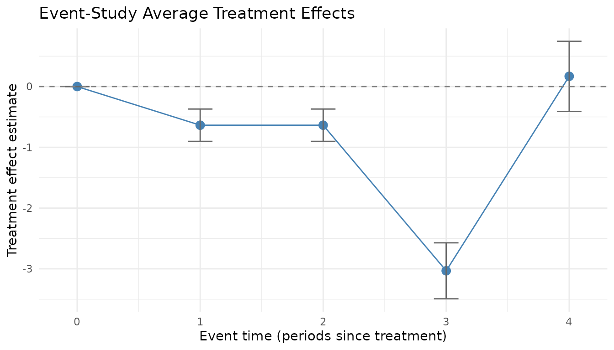
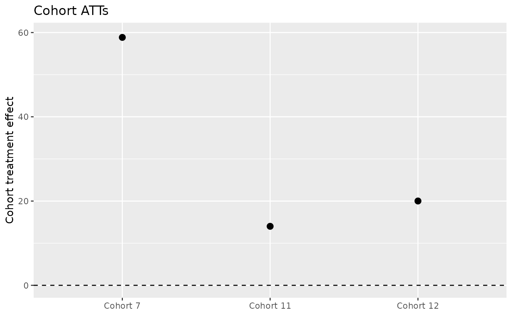

# fetwfe: A Package for Fused Extended Two-Way Fixed Effects

## Introduction

If you understand the basic idea of what difference-in-differences with
staggered adoptions is, all you need to know about fused extended
two-way fixed effects (FETWFE) to get started using the
[fetwfe](https://gregfaletto.github.io/fetwfePackage/) package is this:
given an appropriately formatted panel data set,
[`fetwfe()`](https://gregfaletto.github.io/fetwfePackage/reference/fetwfe.md)
will give you an estimate of the overall average treatment effect on the
treated units, the average treatment effect within each cohort, and
standard errors for each of these estimates.

Feel free to skip to the “Package Usage” section if you want to jump
right in to using the package. In the next “Background” subsection, you
can read a little more background information on the methodology if
you’d like.

### Background

This vignette is written under the assumption that you’re at least
vaguely familiar with developments in
[difference-in-differences](https://en.wikipedia.org/wiki/Difference_in_differences)
with [staggered
adoptions](https://mike-data-analysis.share.connect.posit.cloud/sec-difference-in-differences.html#sec-multiple-periods-and-variation-in-treatment-timing)
since about 2018. Just to make sure we’re on the same page, the brief
recap is:

- Historically, under staggered adoptions researchers used the [standard
  two-way fixed effects
  estimator](https://mike-data-analysis.share.connect.posit.cloud/sec-difference-in-differences.html#sec-two-way-fixed-effects)
  and interpreted the coefficient on the treatment dummy as an average
  treatment effect on the treated units.
- In the late 2010s, econometricians formally checked what this
  estimator was doing and found that in fact, this coefficient was not
  any kind of reasonable average treatment effect estimator.
- Since then, a number of new difference-in-differences estimators that
  are asymptotically unbiased under staggered adoptions have been
  developed.

The estimator in this package, fused extended two-way fixed effects
(FETWFE), is one of those asymptotically unbiased estimators. Of course,
I made this estimator because I think FETWFE brings something to the
table that the others don’t. Here’s a brief summary on that:

One issue with these estimators has been that they’ve worked so hard to
be unbiased that they are **inefficient** (in the language of
econometrics), or **high-variance** (in the language of machine
learning). These estimators add extra parameters in order to remove
bias, but estimating extra parameters means you have less data per
parameter and your estimates are noisier.

In machine learning, creating a more flexible estimator with lots of
parameters and then finding that it is too high variance (that is, it
*overfits*) is a familiar issue. The most common solution has been
regularization.

You could just add $`\ell_2`$ or $`\ell_1`$ regularization to a
difference-in-differences regression estimator and probably see an
improvement in your efficiency, but FETWFE does something more
sophisticated than that. (Plus, that approach wouldn’t allow you to get
valid standard errors for your treatment effect estimates, but FETWFE
does.) Qualitatively, FETWFE uses machine learning to learn which of
these added parameters were actually unnecessary to add, and then takes
them back out in order to improve efficiency.

That’s all the description I’ll give you in this vignette. You can learn
all of the details in the paper on arXiv:

> **[Fused Extended Two-Way Fixed Effects for Difference-in-Differences
> With Staggered Adoptions](https://arxiv.org/abs/2312.05985)**

If you want to learn a little more before you dive into the full paper,
here are some other resources with descriptions of the methodology that
provide a little more detail than this vignette:

- My [blog
  post](https://gregoryfaletto.com/2023/12/13/new-paper-fused-extended-two-way-fixed-effects-for-difference-in-differences-with-staggered-adoptions/)
  announcing the paper.
- [Some
  slides](https://gregoryfaletto.com/2024/02/11/presentation-on-fused-extended-two-way-fixed-effects/)
  I made for a presentation on FETWFE.
- Another [blog
  post](https://gregoryfaletto.com/2025/01/03/new-r-fetwfe-package-implementing-fused-extended-two-way-fixed-effects/)
  focused on what this package is doing under the hood.

But the headline summary of what fused extended two-way fixed effects
brings to the table in a crowded field of estimators is: **fused
extended two-way fixed effects is not only unbiased, it also uses
machine learning to maximize efficiency (minimize variance)**. Further,
unlike many machine learning estimators, **fused extended two-way fixed
effects gives you valid standard errors for the treatment effect
estimates.**

## Package Usage

The package provides a single exported function,
[`fetwfe()`](https://gregfaletto.github.io/fetwfePackage/reference/fetwfe.md),
which implements the FETWFE estimator. Its primary arguments include:

- **`pdata`**: A data frame in panel (long) format.
- **`time_var`**: A character string specifying the name of the time
  period variable.
- **`unit_var`**: A character string specifying the unit (e.g. state,
  firm) variable.
- **`treatment`**: A character string specifying the treatment indicator
  variable (which must be an absorbing binary indicator).
- **`response`**: A character string specifying the response (outcome)
  variable.
- **`covs`**: A character vector of covariate names (typically
  time-invariant or the pre-treatment values), if applicable.
- **Additional tuning parameters:** such as the tuning parameter for the
  bridge penalty (controlled via argument `q`), the geometry of the
  fusion penalty (`fusion_structure`, either the default `"cohort"` or
  `"event_study"`, or a fully custom `fusion_matrix`), and options for
  verbosity, standard error calculation, and so on.

The function returns a list containing, for example, the estimated
overall average treatment effect, cohort-specific treatment effects,
standard errors (when available), and various diagnostic quantities.

You can get the full documentation details by using
[`?fetwfe`](https://gregfaletto.github.io/fetwfePackage/reference/fetwfe.md)
in R when you have the package loaded.

**The workflow in three moves.** Working with a fit comes down to:

1.  **Fit** — call
    [`fetwfe()`](https://gregfaletto.github.io/fetwfePackage/reference/fetwfe.md)
    on your panel.
2.  **Extract** — pull out the treatment effects by the view you want:
    [`cohortStudy()`](https://gregfaletto.github.io/fetwfePackage/reference/cohortStudy.md)
    (per adoption cohort),
    [`eventStudy()`](https://gregfaletto.github.io/fetwfePackage/reference/eventStudy.md)
    (per time since treatment), or
    [`cohortTimeATTs()`](https://gregfaletto.github.io/fetwfePackage/reference/cohortTimeATTs.md)
    (the fully disaggregated cohort-by-time cells); the overall ATT is
    on the fit as `att_hat` / `att_se`.
3.  **Plot** — visualize them with `plot(fit, type = "event_study")` or
    `plot(fit, type = "catt")`.

The rest of this vignette expands on each of these.

For a detailed discussion of how the package’s standard errors are
computed, the assumptions they rely on, and an experimental
cluster-robust option (`se_type = "cluster"`) suitable as a sensitivity
check, see the companion vignette `inference_vignette`. Two further
companion vignettes cover family-wise simultaneous confidence bands
([`simultaneousCIs()`](https://gregfaletto.github.io/fetwfePackage/reference/simultaneousCIs.md))
and the selection-consistency zero-effect test
(`simultaneous_cis_vignette`), and high-dimensional debiased inference
via
[`debiasedATT()`](https://gregfaletto.github.io/fetwfePackage/reference/debiasedATT.md)
(`high_dimensional_vignette`).

In the next sections, we’ll walk through examples of how
[`fetwfe()`](https://gregfaletto.github.io/fetwfePackage/reference/fetwfe.md)
is used.

### Simulated Data Example

I’ll start illustrating how to use
[`fetwfe()`](https://gregfaletto.github.io/fetwfePackage/reference/fetwfe.md)
by using a simulated data set. The example below simulates a balanced
panel with 20 time periods and 30 individuals. Each individual is
assigned at random to one of five cohort levels; with the randomly drawn
treatment timing, three of those levels resolve to cohorts that are
actually treated within the panel window and the rest are never treated.

In the simulation, each individual is assigned a random cohort (which
determines the timing of treatment) and three time-invariant covariates
are generated. The response variable is constructed so that, after
treatment, its evolution depends on a treatment effect (which varies by
cohort) and a linear trend, plus the covariates and some random noise.

Below is the complete code for simulating the data, converting it into
the required pdata format, and running the
[`fetwfe()`](https://gregfaletto.github.io/fetwfePackage/reference/fetwfe.md)
function.

**I borrowed some of the below code from [Asjad
Naqvi](https://asjadnaqvi.github.io/)’s helpful [website for DiD
estimators](https://asjadnaqvi.github.io/DiD/docs/code_r). Thanks for
sharing the code publicly!**

``` r

# Set seed for reproducibility
set.seed(123456L)

# 20 time periods, 30 individuals, and 5 cohort levels
tmax = 20; imax = 30; nlvls = 5

dat =
  expand.grid(time = 1:tmax, id = 1:imax) |>
  within({
    cohort      = NA
    effect      = NA
    first_treat = NA
    cov1        = NA
    cov2        = NA
    cov3        = NA
    for (chrt in 1:imax) {
      cohort = ifelse(id==chrt, sample.int(nlvls, 1), cohort)
    }
    for (lvls in 1:nlvls) {
      effect      = ifelse(cohort==lvls, sample(2:10, 1), effect)
      first_treat = ifelse(cohort==lvls, sample(1:(tmax+6), 1), first_treat)
    }
    # three time-invariant covariates: one value per individual,
    # drawn AFTER the timing loop so first_treat is unchanged
    for (chrt in 1:imax) {
      cov1 = ifelse(id==chrt, rnorm(1), cov1)
      cov2 = ifelse(id==chrt, rnorm(1), cov2)
      cov3 = ifelse(id==chrt, rnorm(1), cov3)
    }
    first_treat = ifelse(first_treat>tmax, Inf, first_treat)
    treat       = time >= first_treat
    rel_time    = time - first_treat
    y           = id + time + ifelse(treat, effect*rel_time, 0) +
                  0.5*cov1 - 0.7*cov2 + 1.2*cov3 + rnorm(imax*tmax)
    rm(chrt, lvls, cohort, effect)
  })

head(dat)
```

    ##   time id         y rel_time treat       cov3      cov2       cov1 first_treat
    ## 1    1  1 1.3403587     -Inf FALSE -0.5019485 0.1582893 -0.8962503         Inf
    ## 2    2  1 0.2842639     -Inf FALSE -0.5019485 0.1582893 -0.8962503         Inf
    ## 3    3  1 3.7222320     -Inf FALSE -0.5019485 0.1582893 -0.8962503         Inf
    ## 4    4  1 3.6309664     -Inf FALSE -0.5019485 0.1582893 -0.8962503         Inf
    ## 5    5  1 6.6701082     -Inf FALSE -0.5019485 0.1582893 -0.8962503         Inf
    ## 6    6  1 6.0159986     -Inf FALSE -0.5019485 0.1582893 -0.8962503         Inf

The simulated data (`dat`) now has columns for time, id, a treatment
indicator (`treat`), three time-invariant covariates (`cov1`, `cov2`,
`cov3`), and a response variable (`y`). Next, we convert this data into
the panel data format required by
[`fetwfe()`](https://gregfaletto.github.io/fetwfePackage/reference/fetwfe.md).

``` r

library(dplyr)

# Specify column names for the pdata format
time_var <- "time"       # Column for the time period
unit_var <- "unit"       # Column for the unit identifier
treatment <- "treated"   # Column for the treatment dummy indicator
response <- "response"   # Column for the response variable

# Convert the dataset
pdata <- dat |>
  mutate(
    # Rename id to unit and convert to character
    {{ unit_var }} := as.character(id),
    # Ensure treatment dummy is 0/1
    {{ treatment }} := as.integer(treat),
    # Rename y to response
    {{ response }} := y
  ) |>
  select(
    {{ time_var }}, {{ unit_var }}, {{ treatment }}, {{ response }},
    cov1, cov2, cov3
  )

# Preview the resulting pdata dataframe
head(pdata)
```

    ##   time unit treated  response       cov1      cov2       cov3
    ## 1    1    1       0 1.3403587 -0.8962503 0.1582893 -0.5019485
    ## 2    2    1       0 0.2842639 -0.8962503 0.1582893 -0.5019485
    ## 3    3    1       0 3.7222320 -0.8962503 0.1582893 -0.5019485
    ## 4    4    1       0 3.6309664 -0.8962503 0.1582893 -0.5019485
    ## 5    5    1       0 6.6701082 -0.8962503 0.1582893 -0.5019485
    ## 6    6    1       0 6.0159986 -0.8962503 0.1582893 -0.5019485

Now that `pdata` is properly formatted, we run the FETWFE estimator on
the simulated data.

``` r

library(fetwfe)

# Run the FETWFE estimator on the simulated data
result <- fetwfe(
  pdata = pdata,                        # The panel dataset
  time_var = "time",                    # The time variable
  unit_var = "unit",                    # The unit identifier
  treatment = "treated",                # The treatment dummy indicator
  response = "response",                # The response variable
  covs = c("cov1", "cov2", "cov3")      # The time-invariant covariates
)

# Display the average treatment effect estimates
summary(result)
```

    ## Summary of Fused Extended Two-Way Fixed Effects
    ## ================================================
    ## 
    ## Overall ATT: 30.4626  (SE = 4.1889, p = 3.535e-13, 95% CI = [22.2525, 38.6726])
    ## Selected: TRUE
    ## 
    ## CATT (preview) [simultaneous 95% CI]:
    ##  cohort estimate        se   ci_low  ci_high p_value selected
    ##       7 58.84753 0.2165463 58.33381 59.36124       0     TRUE
    ##      11 14.00563 0.2344958 13.44934 14.56193       0     TRUE
    ##      12 20.01437 0.1830776 19.58006 20.44869       0     TRUE
    ## 
    ## Event Study (preview) [simultaneous 95% CI]:
    ##  event_time n_cohorts   estimate        se      ci_low    ci_high      p_value
    ##           0         3   1.283027 0.2459480   0.6170528   1.949000 1.303408e-06
    ##           1         3   6.396242 0.5106127   5.0136135   7.778871 0.000000e+00
    ##           2         3  11.291839 0.9463132   8.7294283  13.854250 0.000000e+00
    ##           3         3  18.229410 1.4991523  14.1700307  22.288790 0.000000e+00
    ##           4         3  23.403446 2.0417170  17.8749187  28.931973 0.000000e+00
    ##           5         3  29.525165 2.7279717  22.1384088  36.911921 0.000000e+00
    ##           6         3  33.886714 2.9253379  25.9655329  41.807895 0.000000e+00
    ##           7         3  39.974990 3.6601035  30.0642229  49.885757 0.000000e+00
    ##           8         3  46.988747 4.0877163  35.9200972  58.057397 0.000000e+00
    ##           9         2  60.016166 8.2868965  37.5770456  82.455286 2.591150e-12
    ##          10         1  89.791179 0.5431113  88.3205512  91.261806 0.000000e+00
    ##          11         1  98.188340 0.5431113  96.7177126  99.658968 0.000000e+00
    ##          12         1 107.809727 0.4963810 106.4656349 109.153819 0.000000e+00
    ##          13         1 118.370341 0.4963810 117.0262492 119.714434 0.000000e+00
    ##          14         0   0.000000        NA          NA         NA           NA
    ##          15         0   0.000000        NA          NA         NA           NA
    ##          16         0   0.000000        NA          NA         NA           NA
    ##          17         0   0.000000        NA          NA         NA           NA
    ##          18         0   0.000000        NA          NA         NA           NA
    ## 
    ## Model Details:
    ##   Units (N)           : 30
    ##   Time periods (T)    : 20
    ##   Treated cohorts (G) : 3
    ##   Covariates (d)      : 3
    ##   Features (p)        : 223
    ##   Selected size       : 42
    ##   Lambda*             : 0.0309

When you run this code, the function internally performs all the
necessary data preparation, applies the fusion penalty via a bridge
regression (using the `grpreg` package), and returns a list with overall
and cohort-specific treatment effect estimates, standard errors (if
available), and additional diagnostics.

By default the fusion penalty uses the within-/between-cohort structure,
but you can instead fuse treatment effects by event time (time since
treatment) with `fusion_structure = "event_study"`, or supply a fully
custom fusion matrix. For when to prefer each, see the vignette
[“Choosing a fusion structure: cohort vs. event-study
penalties”](https://gregfaletto.github.io/fetwfePackage/articles/fusion_structure_vignette.md)
([`vignette("fusion_structure_vignette", package = "fetwfe")`](https://gregfaletto.github.io/fetwfePackage/articles/fusion_structure_vignette.md)).

### A “Real Data” Example

Next I illustrate FETWFE in an empirical context. I’ll use the `divorce`
data set from the `bacondecomp` package, which comes from the study by
Stevenson and Wolfers (2006) of unilateral (“no-fault”) divorce laws and
female suicide rates. It is a balanced state-year panel covering 51
states over 1964-1996, with the reforms adopted in a staggered,
scattered fashion across states. This is the empirical application in
Section 8.2 of Faletto (2025).

``` r

library(bacondecomp)  # for the example data

# Load the data and restrict to the female subset (`sex == 2`), the sample
# analyzed by Stevenson and Wolfers (2006).
data(divorce)
divorce_f <- divorce[divorce$sex == 2, ]

# - 'year' is the time period, 'st' is the unit (state) identifier;
# - 'changed' is already an absorbing 0/1 divorce-reform indicator;
# - 'suiciderate_elast_jag' is the elasticity-scaled female suicide rate.
# Three covariates enter as controls. fetwfe() automatically drops the 9 states
# already treated by 1964 (first-period-treated) and `murderrate` (missing in
# 1964 for one state); both are reported as warnings, suppressed here for
# brevity. The noise variances are supplied (precomputed by REML) to keep the
# call fast.
res <- suppressWarnings(fetwfe(
    pdata = divorce_f,
    time_var = "year",
    unit_var = "st",
    treatment = "changed",
    covs = c("murderrate", "lnpersinc", "afdcrolls"),
    response = "suiciderate_elast_jag",
    sig_eps_sq = 0.0344,
    sig_eps_c_sq = 0.1507,
    add_ridge = TRUE,
    q = 0.5
    ))

summary(res)
```

    ## Summary of Fused Extended Two-Way Fixed Effects
    ## ================================================
    ## 
    ## Overall ATT: -0.0602  (SE = 0.0188, p = 0.001376, 95% CI = [-0.0970, -0.0233])
    ## Selected: TRUE
    ## 
    ## CATT (preview) [simultaneous 95% CI]:
    ##  cohort    estimate          se       ci_low      ci_high      p_value selected
    ##    1969  0.00000000 0.000000000  0.000000000  0.000000000           NA    FALSE
    ##    1970 -0.44401171 0.046498180 -0.572555501 -0.315467911 0.000000e+00     TRUE
    ##    1971 -0.02633974 0.020112012 -0.081939211  0.029259735 8.474215e-01     TRUE
    ##    1972 -0.01611957 0.009359074 -0.041992646  0.009753503 5.468636e-01     TRUE
    ##    1973 -0.06452464 0.013062067 -0.100634602 -0.028414670 7.037395e-06     TRUE
    ##    1974 -0.03001991 0.012978739 -0.065899516  0.005859696 1.707508e-01     TRUE
    ##    1975  0.00000000 0.000000000  0.000000000  0.000000000           NA    FALSE
    ##    1976 -0.04379642 0.063672429 -0.219818270  0.132225427 9.976219e-01     TRUE
    ##    1977 -0.12389080 0.024178412 -0.190731799 -0.057049799 2.691903e-06     TRUE
    ##    1980 -0.04013226 0.061547270 -0.210279123  0.130014613 9.984244e-01     TRUE
    ##    1984  0.00000000 0.000000000  0.000000000  0.000000000           NA    FALSE
    ##    1985  0.14972560 0.050875421  0.009080967  0.290370243 2.880518e-02     TRUE
    ## 
    ## Event Study (preview) [simultaneous 95% CI]:
    ##  event_time n_cohorts     estimate          se      ci_low      ci_high
    ##           0        12  0.000000000 0.000000000  0.00000000  0.000000000
    ##           1        12  0.007021230 0.008967259 -0.01711252  0.031154980
    ##           2        12  0.007021230 0.008967259 -0.01711252  0.031154980
    ##           3        12 -0.002432030 0.012215187 -0.03530699  0.030442926
    ##           4        12 -0.003617641 0.011148464 -0.03362171  0.026386424
    ##           5        12 -0.003617641 0.011148464 -0.03362171  0.026386424
    ##           6        12 -0.011132396 0.014720658 -0.05075037  0.028485581
    ##           7        12 -0.021202910 0.015683174 -0.06341132  0.021005503
    ##           8        12 -0.037944910 0.018119407 -0.08671000  0.010820183
    ##           9        12 -0.037944910 0.018119407 -0.08671000  0.010820183
    ##          10        12 -0.074506291 0.024798078 -0.14124581 -0.007766769
    ##          11        12 -0.074506291 0.024798078 -0.14124581 -0.007766769
    ##          12        11 -0.082814477 0.023894781 -0.14712294 -0.018506015
    ##          13        10 -0.085180605 0.024460058 -0.15101041 -0.019350801
    ##          14        10 -0.085180605 0.024460058 -0.15101041 -0.019350801
    ##          15        10 -0.088610436 0.024705385 -0.15510049 -0.022120380
    ##          16        10 -0.088610436 0.024705385 -0.15510049 -0.022120380
    ##          17         9 -0.116556469 0.025754859 -0.18587099 -0.047241944
    ##          18         9 -0.116556469 0.025754859 -0.18587099 -0.047241944
    ##          19         9 -0.126407960 0.030867474 -0.20948216 -0.043333761
    ##       p_value
    ##            NA
    ##  9.599013e-01
    ##  9.598298e-01
    ##  9.999999e-01
    ##  9.999595e-01
    ##  9.999596e-01
    ##  9.668442e-01
    ##  6.427008e-01
    ##  1.978968e-01
    ##  1.982691e-01
    ##  2.050725e-02
    ##  2.005599e-02
    ##  4.372433e-03
    ##  4.043219e-03
    ##  3.968237e-03
    ##  2.954746e-03
    ##  2.922874e-03
    ##  4.681714e-05
    ##  5.298056e-05
    ##  4.386078e-04
    ##   ... + 12 more event times.
    ## 
    ## Model Details:
    ##   Units (N)           : 42
    ##   Time periods (T)    : 33
    ##   Treated cohorts (G) : 12
    ##   Covariates (d)      : 2
    ##   Features (p)        : 908
    ##   Selected size       : 38
    ##   Lambda*             : 0.0004

``` r

# Average treatment effect on the treated units (in percentage point units)
100 * res$att_hat
```

    ## [1] -6.017477

``` r

# 95% confidence interval for ATT (in percentage point units)

low_att <- 100 * (res$att_hat - qnorm(1 - 0.05 / 2) * res$att_se)
high_att <- 100 * (res$att_hat + qnorm(1 - 0.05 / 2) * res$att_se)

c(low_att, high_att)
```

    ## [1] -9.703624 -2.331330

``` r

# Cohort average treatment effects and confidence intervals (in percentage
# point units). Several cohorts are pruned to exactly zero by the selection.

catt_df_pct <- res$catt_df
catt_df_pct[["estimate"]] <- 100 * catt_df_pct[["estimate"]]
catt_df_pct[["se"]] <- 100 * catt_df_pct[["se"]]
catt_df_pct[["ci_low"]] <- 100 * catt_df_pct[["ci_low"]]
catt_df_pct[["ci_high"]] <- 100 * catt_df_pct[["ci_high"]]

catt_df_pct
```

    ##    cohort   estimate        se      ci_low     ci_high      p_value selected
    ## 1    1969   0.000000 0.0000000   0.0000000   0.0000000           NA    FALSE
    ## 2    1970 -44.401171 4.6498180 -57.2555501 -31.5467911 0.000000e+00     TRUE
    ## 3    1971  -2.633974 2.0112012  -8.1939211   2.9259735 8.474215e-01     TRUE
    ## 4    1972  -1.611957 0.9359074  -4.1992646   0.9753503 5.468636e-01     TRUE
    ## 5    1973  -6.452464 1.3062067 -10.0634602  -2.8414670 7.037395e-06     TRUE
    ## 6    1974  -3.001991 1.2978739  -6.5899516   0.5859696 1.707508e-01     TRUE
    ## 7    1975   0.000000 0.0000000   0.0000000   0.0000000           NA    FALSE
    ## 8    1976  -4.379642 6.3672429 -21.9818270  13.2225427 9.976219e-01     TRUE
    ## 9    1977 -12.389080 2.4178412 -19.0731799  -5.7049799 2.691903e-06     TRUE
    ## 10   1980  -4.013226 6.1547270 -21.0279123  13.0014613 9.984244e-01     TRUE
    ## 11   1984   0.000000 0.0000000   0.0000000   0.0000000           NA    FALSE
    ## 12   1985  14.972560 5.0875421   0.9080967  29.0370243 2.880518e-02     TRUE

FETWFE estimates that adopting a unilateral divorce law is associated
with roughly a -6% change in the elasticity-scaled female suicide rate,
with a 95% confidence interval that excludes zero. The sign and order of
magnitude match Stevenson and Wolfers (2006), who found that these
reforms reduced female suicide. Unlike a fully fused fit, FETWFE’s
selection step retains *heterogeneous* cohort effects here: several
adoption cohorts are pruned to exactly zero while the rest carry
nonzero, varying estimates, so the rows of `res$catt_df` are no longer
all identical.

Unlike the simulated example above, this fit includes covariates (the
`covs` argument). Because FETWFE regularizes the cohort-interacted
design through its bridge penalty, it accommodates covariates even on
this panel’s scattered, single-state adoption cohorts – a setting in
which an unregularized two-way fixed effects fit would be
rank-deficient.

### Testing the zero-effect null

Empirical users of difference-in-differences routinely want to ask “is
this treatment effect statistically distinguishable from zero?”. The
confidence intervals in `catt_df` answer that implicitly — a CI that
excludes 0 corresponds to rejecting `H_0: tau = 0` at level `alpha`
(family-wise across cohorts under the default simultaneous bands). The
package also surfaces a per-cohort `p_value` that matches whichever
interval is displayed: under the default `ci_type = "simultaneous"` it
is the single-step max-T multiplicity-adjusted p-value (the exact dual
of the simultaneous band, so the CI-excludes-0 test and
`p_value < alpha` always agree; version 1.18.0), and under
`ci_type = "pointwise"` the two-sided Wald
`2 * pnorm(-|estimate / se|)`. The overall-ATT `att_p_value` is the
scalar Wald p-value (a single effect, no multiplicity). For
[`fetwfe()`](https://gregfaletto.github.io/fetwfePackage/reference/fetwfe.md)
and
[`betwfe()`](https://gregfaletto.github.io/fetwfePackage/reference/betwfe.md)
there is also a `selected` logical flag, both at the overall ATT level
and per-cohort.

For
[`fetwfe()`](https://gregfaletto.github.io/fetwfePackage/reference/fetwfe.md),
the `selected` flag carries something stronger than the usual CI test.
Under the restriction selection consistency theorem (Theorem 6.2 in the
paper), when the true `tau_ATT(g, t) = 0`, the estimator returns
*exactly* 0 with probability tending to 1. The package’s interpretation:
when `selected = FALSE` for a cohort, the asymptotic conclusion is that
the truth is zero — a strictly stronger statement than what a standard
CI provides. The package surfaces this as an *asymptotic 100% confidence
interval of `{0}`* for selected-out cohorts. For selected-out cohorts,
`p_value` is reported as `NA` — the inferential content lives in
`selected`.

``` r

set.seed(2026)
sim <- genCoefs(G = 3, T = 6, d = 2, density = 0.5, eff_size = 2)
# sim was built without a seed, so draw from the ambient generator (seeded
# just above); seed = NA selects the ambient generator silently.
dat <- simulateData(sim, N = 120, sig_eps_sq = 1, sig_eps_c_sq = 0.5, seed = NA)
res_demo <- fetwfeWithSimulatedData(dat, verbose = FALSE)
res_demo$catt_df
```

    ##   cohort   estimate         se    ci_low    ci_high      p_value selected
    ## 1      2 -0.4137526 0.07754859 -0.586916 -0.2405893 1.906689e-07     TRUE
    ## 2      3 -1.6817852 0.12781952 -1.967202 -1.3963687 0.000000e+00     TRUE
    ## 3      4  0.0000000 0.00000000  0.000000  0.0000000           NA    FALSE

[`betwfe()`](https://gregfaletto.github.io/fetwfePackage/reference/betwfe.md)
uses bridge regression directly on the coefficients (rather than on the
fused restrictions used by
[`fetwfe()`](https://gregfaletto.github.io/fetwfePackage/reference/fetwfe.md)).
Under the bridge oracle property of Kock (2013), `selected = FALSE` for
[`betwfe()`](https://gregfaletto.github.io/fetwfePackage/reference/betwfe.md)
is an analogous asymptotic statement that the truth is zero, under a
sparsity assumption different from the one Theorem 6.2 establishes for
[`fetwfe()`](https://gregfaletto.github.io/fetwfePackage/reference/fetwfe.md).
For
[`etwfe()`](https://gregfaletto.github.io/fetwfePackage/reference/etwfe.md)
and
[`twfeCovs()`](https://gregfaletto.github.io/fetwfePackage/reference/twfeCovs.md),
neither has a selection step, so the `selected` column is omitted; the
`p_value` column is a standard post-OLS t-test.

It is worth keeping in mind that the asymptotic 100% CI of `{0}`
interpretation is an `N -> infinity` statement. In small samples, it may
be wise to read `selected` and `p_value` together rather than relying on
either alone. In particular, even when `selected = TRUE`, the standard
CI may cover zero — the selection step says “the truth is nonzero” but
the magnitude CI says “could be zero”.

### Per-cohort, per-event-time, and per-(cohort, time) accessors

The per-cohort estimates in `res$catt_df` are also reachable through
[`cohortStudy()`](https://gregfaletto.github.io/fetwfePackage/reference/cohortStudy.md),
a function-style accessor parallel to
[`eventStudy()`](https://gregfaletto.github.io/fetwfePackage/reference/eventStudy.md)
for event-time effects. The two are documented and discoverable in the
same way
([`?cohortStudy`](https://gregfaletto.github.io/fetwfePackage/reference/cohortStudy.md),
[`?eventStudy`](https://gregfaletto.github.io/fetwfePackage/reference/eventStudy.md)),
and both return a data frame that plays nicely with
[`broom::tidy()`](https://generics.r-lib.org/reference/tidy.html):

``` r

cs <- cohortStudy(res_demo)
cs
```

    ##   cohort   estimate         se    ci_low    ci_high      p_value selected
    ## 1      2 -0.4137526 0.07754859 -0.586916 -0.2405893 1.906689e-07     TRUE
    ## 2      3 -1.6817852 0.12781952 -1.967202 -1.3963687 0.000000e+00     TRUE
    ## 3      4  0.0000000 0.00000000  0.000000  0.0000000           NA    FALSE

``` r

broom::tidy(cs)
```

    ##       term   estimate  std.error  statistic      p.value  conf.low  conf.high
    ## 1 cohort_2 -0.4137526 0.07754859  -5.335399 1.906689e-07 -0.586916 -0.2405893
    ## 2 cohort_3 -1.6817852 0.12781952 -13.157499 0.000000e+00 -1.967202 -1.3963687
    ## 3 cohort_4  0.0000000 0.00000000         NA           NA  0.000000  0.0000000
    ##   selected
    ## 1     TRUE
    ## 2     TRUE
    ## 3    FALSE

[`cohortStudy()`](https://gregfaletto.github.io/fetwfePackage/reference/cohortStudy.md)
is a pass-through on `res$catt_df` — same rows, same columns — with one
extra S3 class on top (`"cohortStudy"`) that dispatches
[`tidy()`](https://generics.r-lib.org/reference/tidy.html) to a
broom-shape translator. The `catt_df` class underneath is preserved, so
the helpful-error layer on the old Title-Case column names still fires.

For the *fully disaggregated* effects — one row per `(cohort, time)`
cell, with no averaging over either axis — use
[`cohortTimeATTs()`](https://gregfaletto.github.io/fetwfePackage/reference/cohortTimeATTs.md).
This is the finest-grained view, sitting below
[`cohortStudy()`](https://gregfaletto.github.io/fetwfePackage/reference/cohortStudy.md)
(which averages each cohort’s cells over time) and
[`eventStudy()`](https://gregfaletto.github.io/fetwfePackage/reference/eventStudy.md)
(which averages over cohorts at each event time):

``` r

cta <- cohortTimeATTs(res_demo)
head(cta)
```

    ##   cohort time   estimate        se     ci_low    ci_high      p_value selected
    ## 1      2    2  0.0000000 0.0000000  0.0000000  0.0000000           NA    FALSE
    ## 2      2    3  0.0000000 0.0000000  0.0000000  0.0000000           NA    FALSE
    ## 3      2    4  0.0000000 0.0000000  0.0000000  0.0000000           NA    FALSE
    ## 4      2    5 -2.2372560 0.2435678 -2.7146401 -1.7598718 4.101854e-20     TRUE
    ## 5      2    6  0.1684927 0.2435678 -0.3088914  0.6458769 4.890822e-01     TRUE
    ## 6      3    3  0.0000000 0.0000000  0.0000000  0.0000000           NA    FALSE

Its standard errors are the per-cell regression standard errors,
recomputed from the fit exactly as
[`eventStudy()`](https://gregfaletto.github.io/fetwfePackage/reference/eventStudy.md)
does (each cell is a single coefficient, so the cohort-probability
sampling variance that contributes to the aggregated SEs is identically
zero here). Confidence intervals and p-values are pointwise; a cell the
fusion penalty zeroed out has `estimate = 0`, `se = 0`, and
`selected = FALSE`.
[`broom::tidy()`](https://generics.r-lib.org/reference/tidy.html) works
here too (`term = "cohort_<g>_time_<t>"`). For simultaneous
(family-wise) bands over the `(cohort, time)` cell family, use
`simultaneousCIs(res_demo, family = "all_post_treatment")`.

``` r

head(broom::tidy(cta))
```

    ##              term time   estimate std.error  statistic      p.value   conf.low
    ## 1 cohort_2_time_2    2  0.0000000 0.0000000         NA           NA  0.0000000
    ## 2 cohort_2_time_3    3  0.0000000 0.0000000         NA           NA  0.0000000
    ## 3 cohort_2_time_4    4  0.0000000 0.0000000         NA           NA  0.0000000
    ## 4 cohort_2_time_5    5 -2.2372560 0.2435678 -9.1853515 4.101854e-20 -2.7146401
    ## 5 cohort_2_time_6    6  0.1684927 0.2435678  0.6917693 4.890822e-01 -0.3088914
    ## 6 cohort_3_time_3    3  0.0000000 0.0000000         NA           NA  0.0000000
    ##    conf.high selected
    ## 1  0.0000000    FALSE
    ## 2  0.0000000    FALSE
    ## 3  0.0000000    FALSE
    ## 4 -1.7598718     TRUE
    ## 5  0.6458769     TRUE
    ## 6  0.0000000    FALSE

### Plotting the effects

The built-in [`plot()`](https://rdrr.io/r/graphics/plot.default.html)
method draws the effects directly — the event-study view
(`type = "event_study"`, the default) or the per-cohort view
(`type = "catt"`), each with confidence intervals:

``` r

plot(res_demo, type = "event_study")
```



Reading it: each point is the average treatment effect at a given number
of periods since adoption (the *event time*), with its confidence
interval. The plot begins at event time 0 (treatment onset) and traces
how the effect evolves over the post-treatment periods — FETWFE does not
estimate pre-treatment placebo coefficients (they are out of scope; see
[`?eventStudy`](https://gregfaletto.github.io/fetwfePackage/reference/eventStudy.md)),
so there is no pre-trends panel here. Swap in `type = "catt"` for the
per-adoption-cohort effects, where any cohort the fusion penalty pooled
to zero appears pinned exactly at zero — a visual signature of the
fusion. (The `broom` route in the next section is the do-it-yourself
alternative when you want full `ggplot2` control.)

### Tidy outputs with broom

If you use the tidyverse, the fitted object also plays nicely with the
[broom](https://broom.tidymodels.org/) package.
[`tidy()`](https://generics.r-lib.org/reference/tidy.html) reshapes the
overall ATT and per-cohort CATTs into a long data frame with the
standard `term` / `estimate` / `std.error` / `statistic` / `p.value` /
`conf.low` / `conf.high` columns, plus a `selected` flag (see “Testing
the zero-effect null” below):

``` r

library(broom)

tidy_res <- tidy(result)
tidy_res
```

    ##        term estimate std.error  statistic      p.value conf.low conf.high
    ## 1       ATT 30.46257 4.1888700   7.272264 3.535113e-13 22.25254  38.67260
    ## 2  Cohort 7 58.84753 0.2165463 271.754951 0.000000e+00 58.33381  59.36124
    ## 3 Cohort 11 14.00563 0.2344958  59.726581 0.000000e+00 13.44934  14.56193
    ## 4 Cohort 12 20.01437 0.1830776 109.321780 0.000000e+00 19.58006  20.44869
    ##   selected
    ## 1     TRUE
    ## 2     TRUE
    ## 3     TRUE
    ## 4     TRUE

[`glance()`](https://generics.r-lib.org/reference/glance.html) returns a
one-row model-level summary — panel-shape counts, the bridge-regression
tuning, the variance components, and the inference settings:

``` r

glance(result)
```

    ##   nobs n_units n_periods n_cohorts n_covs n_features lambda_star
    ## 1  600      30        20         3      3        223  0.03085978
    ##   lambda_star_model_size lambda_selection cv_folds cv_seed sig_eps_sq
    ## 1                     42               cv       10     600  0.9715147
    ##   sig_eps_c_sq alpha se_type indep_counts_used
    ## 1     90.72021  0.05 default             FALSE

[`augment()`](https://generics.r-lib.org/reference/augment.html) appends
`.fitted` and `.resid` columns to your panel (auto-aligned to the design
the estimator actually fit on, so the same raw `pdata` you handed to
[`fetwfe()`](https://gregfaletto.github.io/fetwfePackage/reference/fetwfe.md)
works):

``` r

head(augment(result, data = pdata))
```

    ##   time unit treated  response       cov1      cov2       cov3  .fitted
    ## 1    1    1       0 1.3403587 -0.8962503 0.1582893 -0.5019485 37.87288
    ## 2    2    1       0 0.2842639 -0.8962503 0.1582893 -0.5019485 39.05406
    ## 3    3    1       0 3.7222320 -0.8962503 0.1582893 -0.5019485 39.71505
    ## 4    4    1       0 3.6309664 -0.8962503 0.1582893 -0.5019485 40.88863
    ## 5    5    1       0 6.6701082 -0.8962503 0.1582893 -0.5019485 41.89930
    ## 6    6    1       0 6.0159986 -0.8962503 0.1582893 -0.5019485 43.22619
    ##      .resid
    ## 1 -36.53252
    ## 2 -38.76980
    ## 3 -35.99282
    ## 4 -37.25766
    ## 5 -35.22919
    ## 6 -37.21019

From there, the tidied output goes straight into `ggplot2` or
`modelsummary` without needing to read the package’s class
documentation:

``` r

library(ggplot2)
tidy_res |> 
  dplyr::filter(term != "ATT") |>
  # Remove non-digits to extract the number, then reorder the factor levels
  dplyr::mutate(term = reorder(term, as.numeric(gsub("\\D", "", term)))) |>
  ggplot(aes(x = term, y = estimate)) +
  geom_pointrange(aes(ymin = conf.low, ymax = conf.high)) +
  geom_hline(yintercept = 0, linetype = "dashed") +
  labs(x = NULL, y = "Cohort treatment effect", title = "Cohort ATTs")
```



See the simulation vignette for an example of how you can use functions
in the FETWFE package to simulate panel data.

## Conclusion

This should be enough to get you started using
[`fetwfe()`](https://gregfaletto.github.io/fetwfePackage/reference/fetwfe.md)
on your own data. Please feel free to [reach
out](https://gregoryfaletto.com/about/) if you have any questions or
feedback or run into any issues using the package. You can also [create
an issue](https://github.com/gregfaletto/fetwfePackage/issues) if you
think there’s a bug in the package or you’d like to request a feature.
**Thanks so much for checking out the package!**

## References

- Cheng, C., & Hoekstra, M. (2013). Does Strengthening Self-Defense Law
  Deter Crime or Escalate Violence? Evidence from Expansions to Castle
  Doctrine. *Journal of Human Resources*, 48(3), 821-854.
- Faletto, G. (2025). Fused Extended Two-Way Fixed Effects for
  Difference-in-Differences with Staggered Adoptions. [arXiv preprint
  arXiv:2312.05985](https://arxiv.org/abs/2312.05985).
- Flack, E., & Jee, E. (2020). bacondecomp: Goodman-Bacon Decomposition.
  R package version 0.1.1.
  <https://CRAN.R-project.org/package=bacondecomp>.
- Kock, A. B. (2013). Oracle inequalities for high-dimensional
  nonparametric models. *Econometric Theory*.
